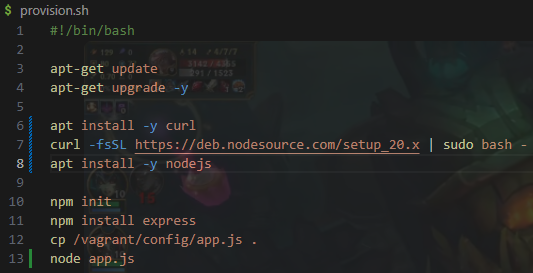
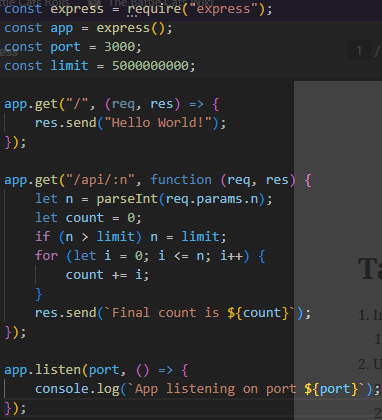
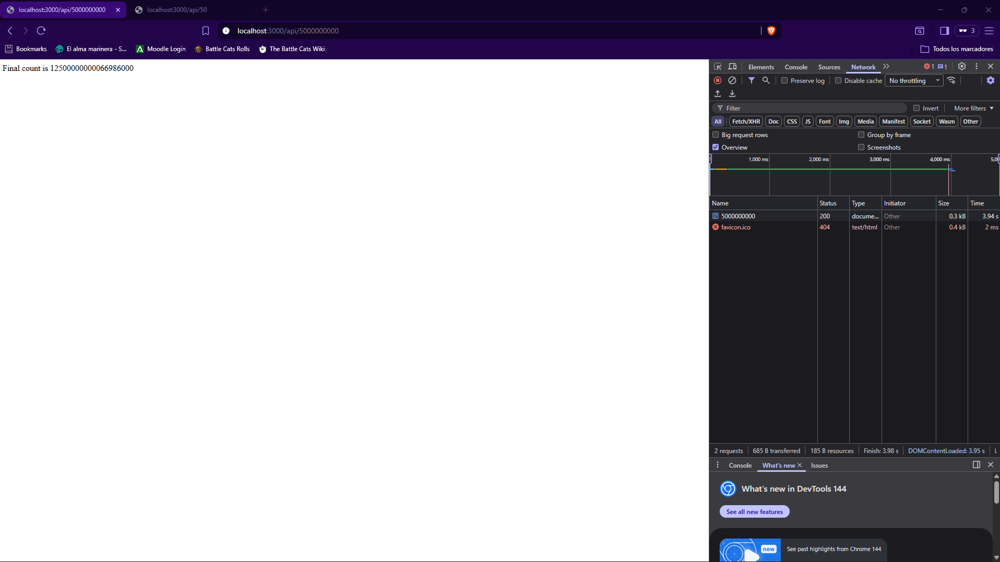
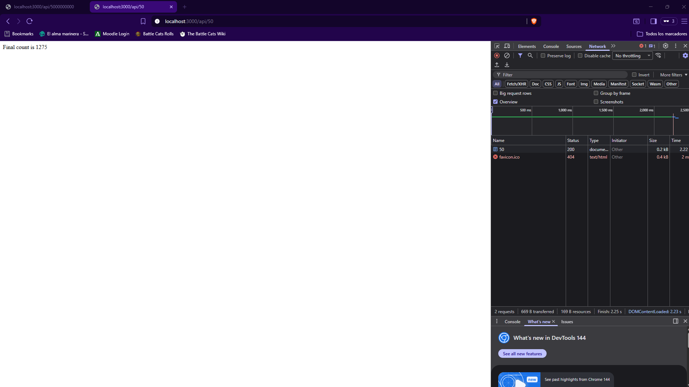
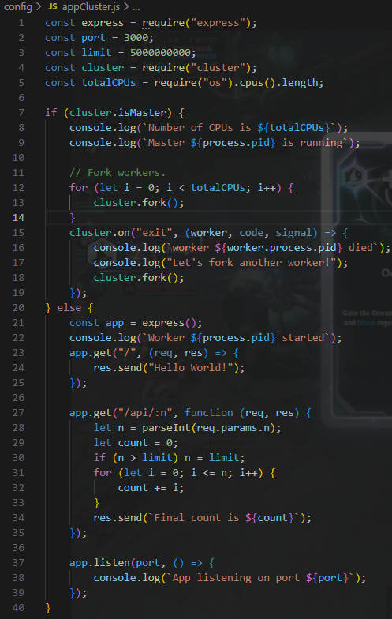
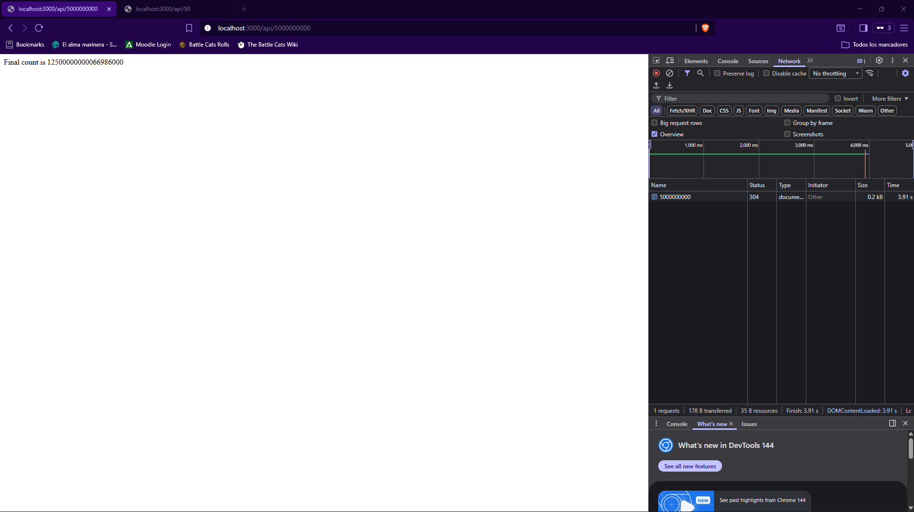
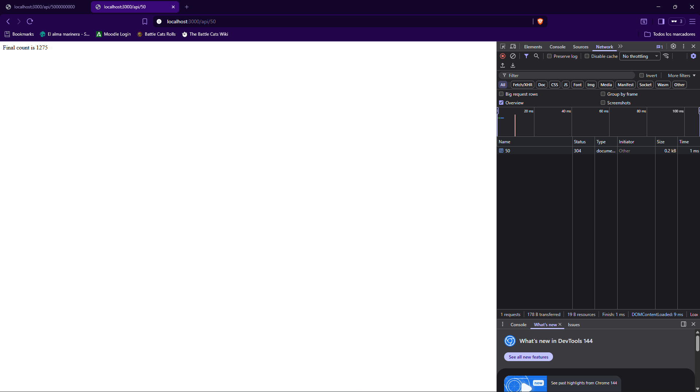

# Práctica de Aplicación en "Cluster" con NodeJS y Express
## Instalación de NodeJS y archivo sin clúster
Ejecutamos los siguientes comandos (la imagen es el archivo de provisión, si usas el repositorio, deberían ejecutarse todos los comandos al crear la máquina con Vagrant).
 
¡Nota, al ser una máquina **debian/bullseye64**, hace falta asignar un paquete de node más reciente al disponible (por eso instalamos curl)!
 

Ahora creamos un archivo JS (en este caso **app.js**) con el siguiente contenido.
 

### Comprobación de funcionamiento sin clúster
Abrimos 2 pestañas (la primera se ejecuta antes que la segunda) y da tiempos desproporcionados por la carga del servidor.
 

 

## Archivo con clúster y comprobación
Ahora creamos un archivo JS con clúster (**appCluster.js**) con el siguiente contenido.
 

### Comprobación de funcionamiento con clúster
Abrimos 2 pestañas (la primera se ejecuta antes que la segunda) y da tiempos desproporcionados por la carga del servidor.
 

 
