# Práctica de Aplicación en "Cluster" con NodeJS y Express
## Instalación de NodeJS y archivo sin clúster
Ejecutamos los siguientes comandos (la imagen es el archivo de provisión, si usas el repositorio, deberían ejecutarse todos los comandos al crear la máquina con Vagrant).
 
¡Nota, al ser una máquina **debian/bullseye64**, hace falta asignar un paquete de node más reciente al disponible (por eso instalamos curl)!
 

Ahora creamos un archivo JS (en este caso **app.js**) con el siguiente contenido.
 

### Comprobación de funcionamiento sin clúster
Abrimos 2 pestañas (la primera se ejecuta antes que la segunda) y da tiempos desproporcionados por la carga del servidor.
 

 

## Archivo con clúster y comprobación
Ahora creamos un archivo JS con clúster (**appCluster.js**) con el siguiente contenido.
 

### Comprobación de funcionamiento con clúster
Abrimos 2 pestañas (la primera se ejecuta antes que la segunda) y da tiempos desproporcionados por la carga del servidor.
 

 

## Tests con el paquete loadtest
Instalamos el paquete **loadtest** con el comando **npm install -g loadtest** (en la provisión)

Mientras se está ejecuta un servicio (sea o no con clúster), ejecutamos el comando **loadtest http://localhost:3000/api/500000 -n 1000 -c 100** para hacer pruebas

### Pruebas sin clúster
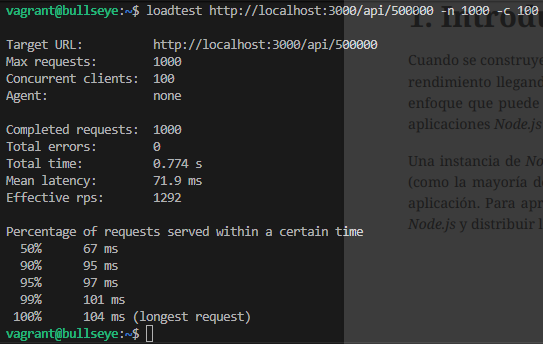
 
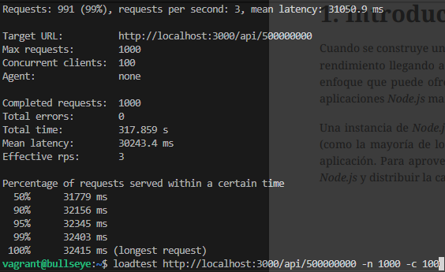

### Pruebas con clúster
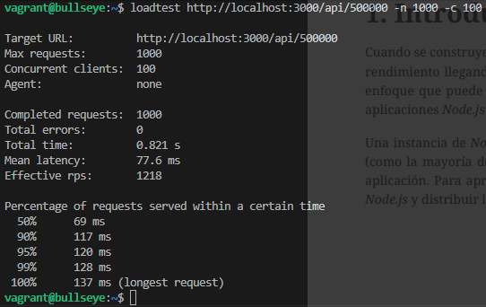
 
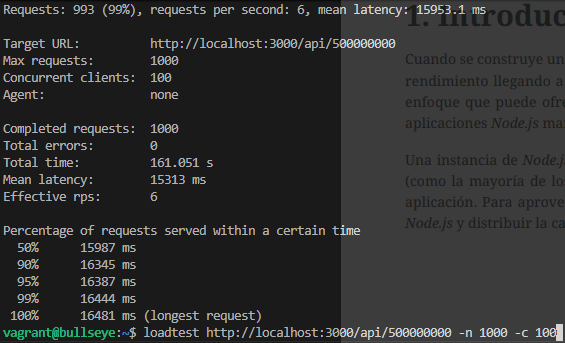

## Instalación y Tests con PM2
Instalamos el paquete **pm2** con el comando **npm install -g pm2** (en la provisión está en la misma línea que loadtest).
 
Para ejecutar la app que queremos, usamos el comando **pm2 start [nombre_app].js -i 0**.
 
Y para pararlo, el comando **pm2 stop [nombre_app].js**.
 

### Pruebas sin clúster
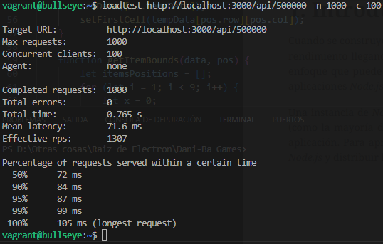
 
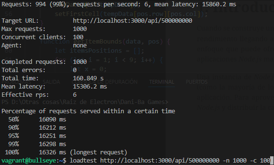

### Pruebas con clúster
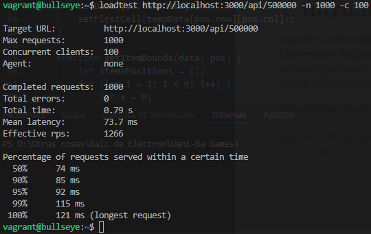
 
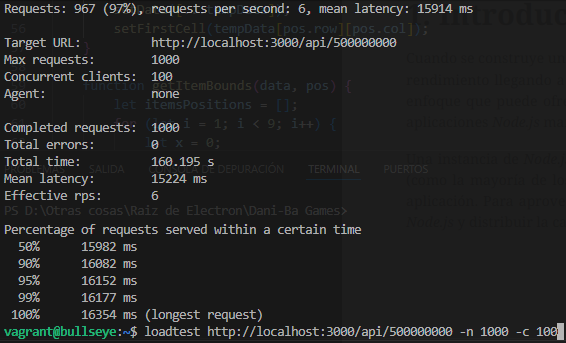

## Crear Ecosystem con PM2
Ejecutamos el comando **ecosystem.config.js** y lo modificamos para que quede así.
 
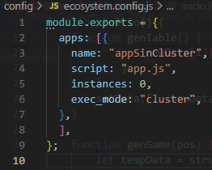

Para ejecutar Ecosystem, símplemente usamos el comando **pm2 [start|restart|reload|stop|delete] ecosystem.config.js**
 
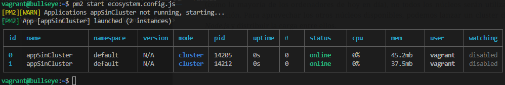

## Tarea
### PM2 ls
El comando **pm2 ls** muestra las instancias creada en pm2 con sus datos.
 
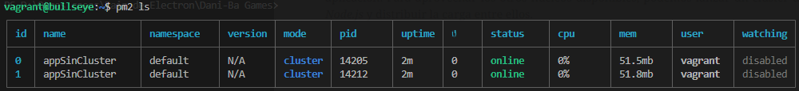

### PM2 logs
El comando **pm2 ls** muestra los logs EN VIVO, significando que está en ejecución constante hasta ser frenado manualmente (de forma predeterminada) y mostrando los logs actuales y próximos hasta la finalización del comando.
 
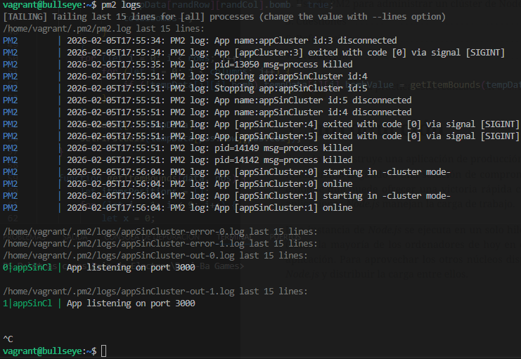

### PM2 monit
El comando **pm2 ls** muestra los procesos en ejecución a mayor detalle y actualizándose cada segundo (y friendly para el usuario), tanto los procesos independientes (y sus logs correspondientes) como otras métricas, como la latencia o la memoria que consume.
 

### Pregunta
**P: ¿Sabrías decir por qué en algunos casos concretos, como este, la aplicación sin clusterizar tiene mejores resultados?**
 
R: La aplicación sin clúster puede rendir mejor porque el clúster consume más recursos, y hay poca concurrencia, pocos núcleos o tareas muy intensivas de CPU, ese consumo adicional puede ser mayor que el beneficio que nos brinda, haciendo que un solo proceso sea más rápido.